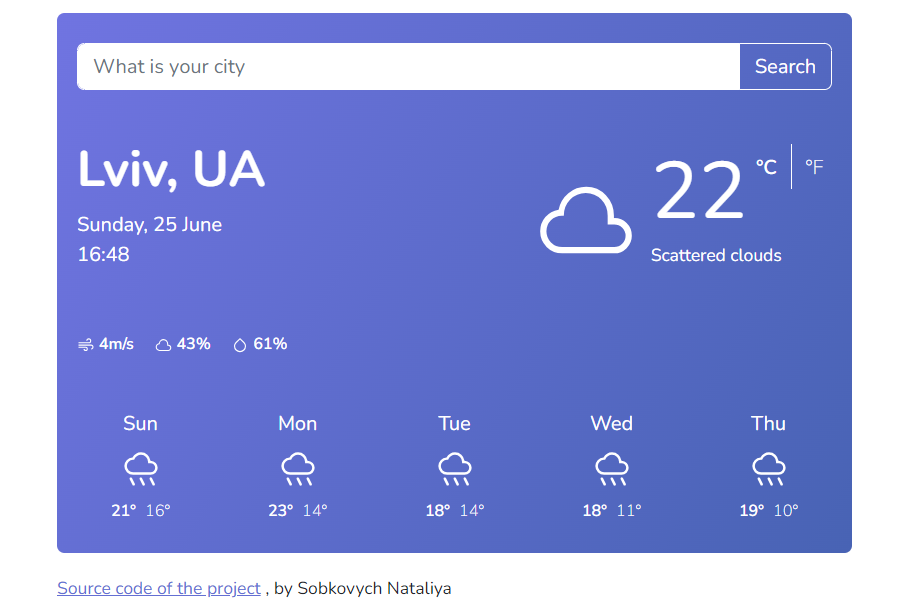

# Weather Forecast App

This Weather Forecast App is a simple web application developed using pure JavaScript. It uses OpenWeatherMap API and provides accurate and up-to-date weather information for the entered city for the entire week. 

## Features:

- The app automatically displays the weather forecast for your location (provided you confirm your data usage) or you can enter any city yourself.
- Easy-to-use interface: Simply enter the name of the city and get the weather forecast for the next seven days.
- Weekly Forecast: View detailed weather information, including temperature, humidity, wind speed, and weather conditions for each day of the week.
- Accurate data: The app retrieves real-time weather data from a reliable weather API to ensure accuracy and reliability.
- Responsive design: The app is optimized for different screen sizes, making it accessible on both desktop and mobile devices.

## Screenshot

